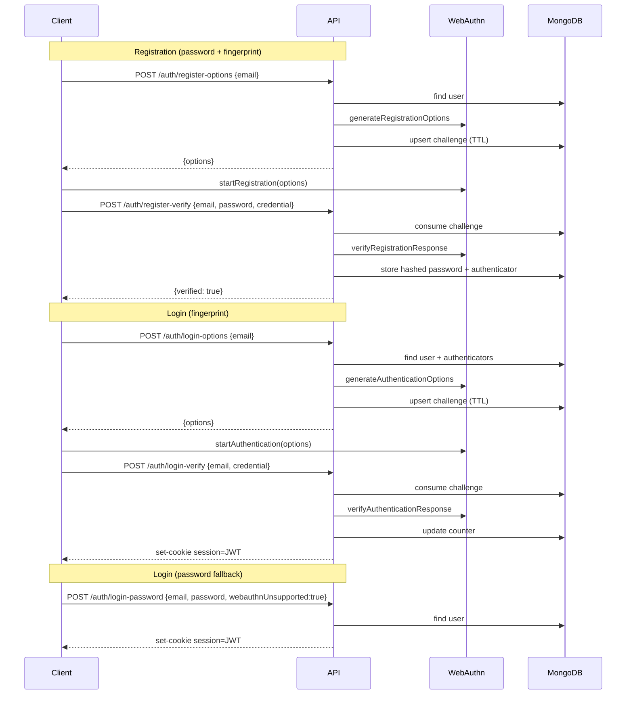

# BiometricAuthenticator

# Setup.

```
pnpm install
```

# Environment Variables

Add a .env.local file at the root of the directory(Biometric)

```
MONGODB_URI=connection_string
RP_ID=localhost
RP_NAME=My App
EXPECTED_ORIGIN=http://localhost:3000
JWT_SECRET=your_jwt_secret
JWT_TTL=1h
```

# Get Started.

# Auth Flow (Sequence Diagram)


