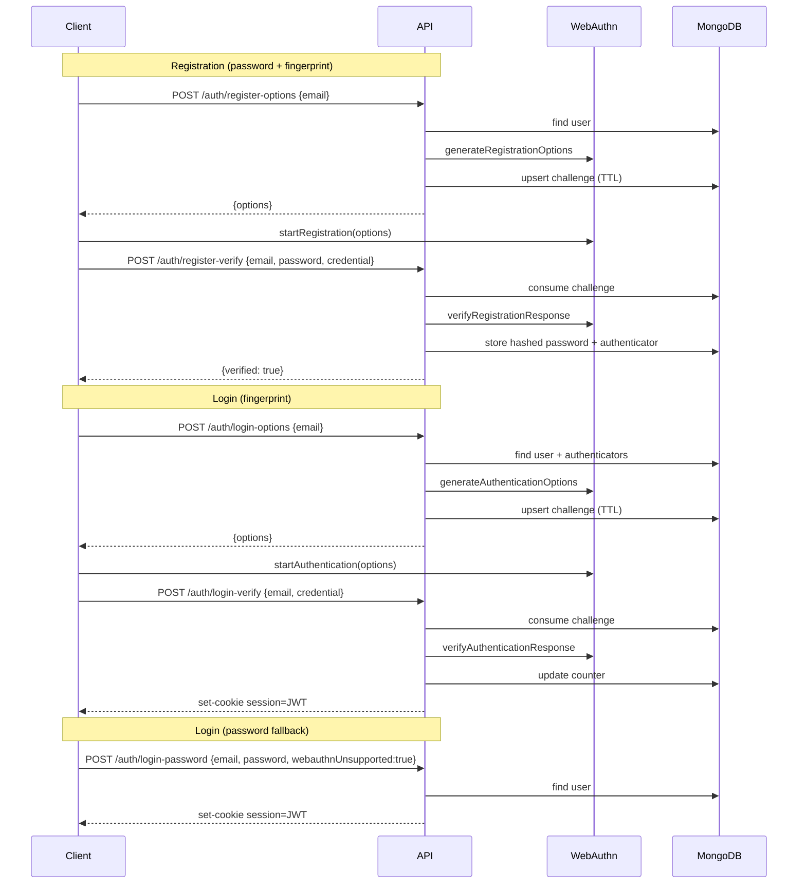

# BiometricAuthenticator

This project implements a biometric authentication system using Next.js, WebAuthn, MongoDB, and Mongoose. It supports fingerprint template storage with AES encryption, role-based access control (RBAC) for admin functionalities, and JWT-based authentication.

## Setup

```bash
pnpm install
```

## Environment Variables

Create a `.env.local` file at the root of the `biometric/` directory (e.g., `biometric/.env.local`) with the following variables:

```
# MongoDB Connection URI
# Example: MONGODB_URI="mongodb://localhost:27017/biometric_db"
# For production, use a secure connection string with appropriate credentials.
MONGODB_URI=your_mongodb_connection_string

# Secret key for JSON Web Tokens (JWT)
# Generate a strong, random string for production.
JWT_SECRET=your_jwt_secret_key

# Relying Party ID for WebAuthn
# This should be your domain (e.g., "example.com") without the protocol.
# For local development, "localhost" is common.
RP_ID=localhost
RP_NAME=My App
EXPECTED_ORIGIN=http://localhost:3000
JWT_SECRET=your_jwt_secret
JWT_TTL=1h
```

# Get Started.

# Auth Flow (Sequence Diagram)



EXPECTED_ORIGIN=http://localhost:3000

 AES Encryption Key for sensitive data (e.g., fingerprint templates)
 This should be a strong, random 32-byte key (64 hexadecimal characters) for AES-256.
 Example: ENCRYPTION_KEY="a1b2c3d4e5f6a7b8c9d0e1f2a3b4c5d6e7f8a9b0c1d2e3f4a5b6c7d8e9f0a1b2"
ENCRYPTION_KEY=your_aes_encryption_key
```

## Get Started

```bash
pnpm run dev
```

## Backend API Documentation

The backend API is built using Next.js API Routes. All API routes require a MongoDB connection (`MONGODB_URI`) and JWT Secret (`JWT_SECRET`) to be configured. WebAuthn-related endpoints also require `RP_ID` and `EXPECTED_ORIGIN`.

### Authentication Endpoints (`/api/auth`)

#### 1. Register Options (`POST /api/auth/register-options`)
Generates registration options (challenge) for a new WebAuthn credential.

*   **Request Body**:
    ```json
    {
        "email": "user@example.com",
        "name": "User Name",
        "phoneNumber": "1234567890",
        "nationalID": 12345678,
        "accountNumber": "ACC12345",
        "password": "strong_password",
        "role": "customer"
    }
    ```
*   **Response**: WebAuthn registration options.

#### 2. Register Verify (`POST /api/auth/register-verify`)
Verifies the WebAuthn registration response and stores the new authenticator, including optional fingerprint template data.

*   **Request Body**:
    ```json
    {
        "email": "user@example.com",
        "body": { /* WebAuthn AuthenticatorAttestationResponse from client */ },
        "fingerprintTemplate": "base64_encoded_fingerprint_template", // Optional, base64 string
        "description": "Right thumb", // Optional, e.g., "Right index finger"
        "isBiometric": true // Optional, defaults to false if not provided, or true if fingerprintTemplate is provided
    }
    ```
*   **Response**:
    ```json
    { "verified": true }
    ```

#### 3. Login Options (`POST /api/auth/login-options`)
Generates authentication options (challenge) for a WebAuthn login.

*   **Request Body**:
    ```json
    {
        "email": "user@example.com"
    }
    ```
*   **Response**: WebAuthn authentication options.

#### 4. Login Verify (`POST /api/auth/login-verify`)
Verifies the WebAuthn authentication response and performs optional fingerprint matching.

*   **Request Body**:
    ```json
    {
        "email": "user@example.com",
        "body": { /* WebAuthn AuthenticatorAssertionResponse from client */ },
        "fingerprintTemplate": "base64_encoded_fingerprint_template" // Optional, base64 string for matching
    }
    ```
*   **Response**:
    ```json
    {
        "verified": true,
        "token": "your_jwt_token"
    }
    ```
    Returns `400` with error if fingerprint template doesn't match or authenticator is not configured for biometrics.

### Admin Endpoints (`/api/admin`)

All admin endpoints require a valid JWT in the `Authorization: Bearer <token>` header, and the authenticated user must have the `admin` role.

#### 1. Get All Users (`GET /api/admin/users`)
Retrieves a paginated list of all users. Accessible only by admin users.

*   **Query Parameters**:
    *   `page`: (Optional) Page number (default: 1)
    *   `limit`: (Optional) Items per page (default: 10)
    *   `role`: (Optional) Filter by user role (e.g., "admin", "customer")
    *   `email`: (Optional) Case-insensitive partial match for email
    *   `name`: (Optional) Case-insensitive partial match for name
    *   `sortBy`: (Optional) Field to sort by (default: "createdAt")
    *   `sortOrder`: (Optional) Sort order ("asc" or "desc", default: "desc")
*   **Headers**:
    ```
    Authorization: Bearer <admin_jwt_token>
    ```
*   **Response**:
    ```json
    {
        "data": [
            {
                "_id": "...",
                "name": "...",
                "phoneNumber": "...",
                "email": "...",
                "role": "...",
                "nationalID": ...,
                "accountNumber": "...",
                "createdAt": "...",
                "updatedAt": "..."
            }
        ],
        "page": 1,
        "limit": 10,
        "totalPages": 1,
        "totalUsers": 1
    }
    ```

### Database Schema

The application uses MongoDB with Mongoose. Key schemas are:

#### User Schema
Defines user details and embeds `Authenticator` schemas.
*   `name`: String, required
*   `phoneNumber`: String, required
*   `email`: String, required, unique
*   `password`: String, required (hashed)
*   `role`: Enum ("admin", "customer"), default "customer"
*   `nationalID`: Number, required, unique
*   `accountNumber`: String, required, unique
*   `currentChallenge`: String, optional (for WebAuthn)
*   `authenticators`: Array of `Authenticator` Schema

#### Authenticator Schema
Defines WebAuthn credentials and includes fields for biometric fingerprint templates.
*   `credentialID`: Buffer, required (encrypted at rest by Mongoose getter/setter)
*   `credentialPublicKey`: Buffer, required
*   `counter`: Number, required
*   `credentialDeviceType`: String, required
*   `credentialBackedUp`: Boolean, required
*   `transports`: Array of String
*   `fingerprintTemplate`: Buffer, optional (AES encrypted at rest using `ENCRYPTION_KEY`)
*   `description`: String, optional (e.g., "Right thumb")
*   `isBiometric`: Boolean, default `false` (set to `true` if `fingerprintTemplate` is provided during registration)
